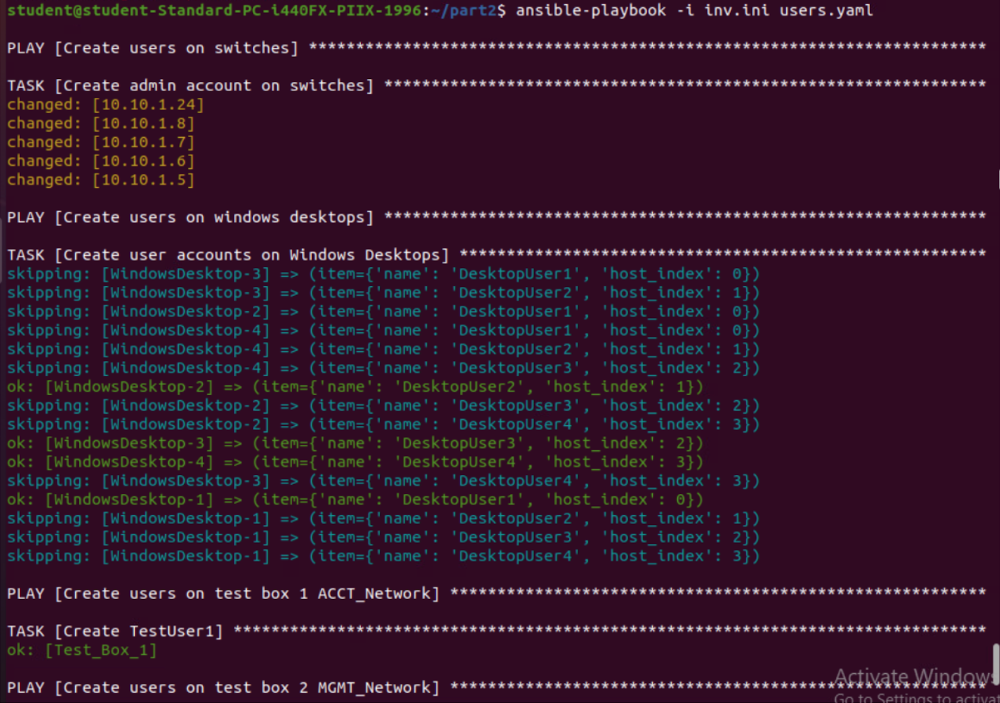
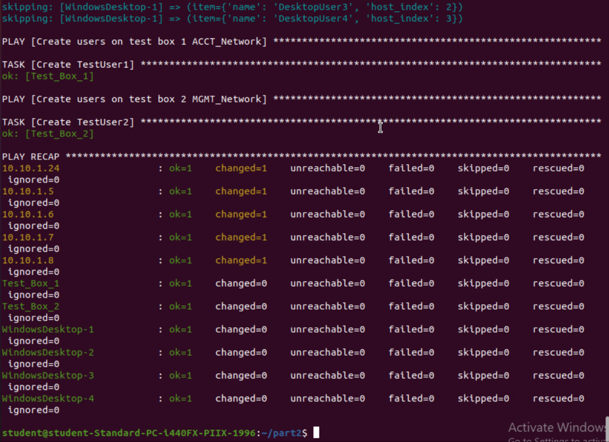

# Part II: User Account Automation 

F. Create an inventory file that includes the configuration settings for each switch, Windows desktop, and test box that is in Access Closet 1 in the N-CoreA-01 (10.10.1.1) network. Provide a copy of your inventory file.  
- [View inv.ini](inv.ini)
     
G. Use Ansible to automate the creation of local user accounts on each of the following devices in Access Closet 1: the switches, the four Windows desktops, and the test boxes on the account and management networks. Your automation solution for user accounts on each device must include the following:
- user names, passwords, and access levels as defined in the “Network Automation Scenario” attachment
- Provide screenshots with your description that document your successful Ansible playbook integration, including your Python scripts and the verified latest output. 
- documentation of your successfully run code in a private Git repository

  [View playbook users.yaml](users.yaml)

The results of running `ansible-playbook -i inv.ini users.yaml`  
  
  

H. Describe the process you used to complete the automation of user accounts and include each of the following in your description:
- a list of the industry-standard tools used
- the outputs
- the inventory
- the validation, testing, and troubleshooting steps completed throughout the process  

#### The industry-standard tools used were Python, OpenSSH, Ansible, and WinRM.  
  -  Python is a programming language used for scripting and automation.  
  -  OpenSSH is an open-source tool for secure remote access (SSH).  
  -  Ansible is used for configuration management and orchestration.  
  -  Windows Remote Management (WinRM) is used for managing windows hosts remotely.  


#### The outputs

- Switches: 
  - User name: Local-Admin
  - Password: XXXXXX
  - Access Level: Read/Write (or device equivalent)

- Four Windows desktops on User_Network:
  - User name: DesktopUser1, DesktopUser2, DesktopUser3, DesktopUser4
  - Password: XXXXXX
  - Access Level: Local Admin

- Test boxes on ACCT_Network and MGMT_Network:
  - User name: TestUser1 (ACCT_Network) and TestUser2 (MGMT_Network)
  - Password: XXXXXX
  - Access Level: Local Admin  
 <br>

The inventory file includes the hostnames, host IP addresses, usernames, and passwords for authentication. I created a ‘vars’ section for each inventory group for unique configuration groupings.  


#### Validation, Testing, and Troubleshooting

In order to find the IP of each switch, run this command  
`show configuration | include ipaddress`  

Check if ansible-playbook identifies the hosts  
`ansible-playbook users.yaml –i inv.ini —lists-hosts`  

Before running the playbook, I used ping to ensure that a connection can be established. Win_ping only ping windows machines, while ping will work for devices that are not windows desktops.  
`ansible windows -m win_ping -i inv.ini`  
`Ansible all –m ping –i inv.ini`
<br>  
- The playbook creates accounts on 3 different types of devices, so the correct ansible_python_interpreter was required. The switches gave a warning when running the playbook, so I auto_silent for its python interpreter. The two containers use python3.

- There were issues creating the corresponding user name to the windows desktop name in the inventory file, so I placed each name on a host_index. This makes sure the names are created in order based on the list in the inventory file.

- I did need to validate correctness of the YAML syntax in users.yaml and to make sure that certain tasks were at the playbook level. 

- I used gather_facts: false because they were not needed.
<br>

### Setup for the windows desktops

We need to add WinRM and open the firewall  
`winrm quickconfig`  
`winrm enumerate winrm/config/Listener`  
`configure firewall 5985`  

Add this to windows variables in the inventory file.
```
[windows:vars]
ansible_user=XXXXXX
ansible_password=XXXXXX
ansible_connection=winrm
ansible_winrm_transport=ntlm
ansible_winrm_server_cert_validation=ignore
ansible_port=5985
```  

### Setup for the Exos switches

Add user account ‘wguadmin’ for Part 1  
`create account admin XXXXXX XXXXXX`  

Add user account ‘ansible’ for ansible  
`create account admin ansible ansible`  

Add this to the switches variables in the inventory file
```
[switches:vars]  
ansible_user=ansible  
ansible_password=ansible  
ansible_network_os=exos  
ansible_connection=network_cli
```  


### Setup for the test boxes
Add user account for ansible ‘ansible’  
`sudo adduser ansible`  

Add a static IP so it doesn’t change  
`sudo nano /etc/netplan/00-installer-config.yaml`  

Edit in file and exit  
```
network:  
  ethernets:  
    eth0:  
      addresses: [10.10.1.55/24]  
      gateway4: 192.168.0.1  
      nameservers:  
        addresses: [8.8.8.8, 8.8.4.4]  
  version: 2
```  

Apply the configuration and restart  
`sudo netplan apply`  
`sudo systemctl restart systemd-networkd`  

Confirm the static IP address is added  
`ip addr show`

Make sure ‘ansible’ user has sudo privileges  
`sudo visudo`  
Add under user  
`ansible ALL=(ALL) NOPASSWD:ALL`  

Add to test box inventory file to avoid sudo permission errors  
`ansible_become=yes `


### Setup for the ansible desktop

Install the proper modules for ansible  
`sudo apt-get install build-essential libssl-dev libffi-dev -y`  
`sudo ansible-galaxy collection install ansible.netcommon`  
`sudo ansible-galaxy collection install extreme.exos`  
`sudo ansible-galaxy collection install community.network`  

Install piwinrm to work with winrm  
`Pip install pywinrm`  

Install necessary ssh components for ansible  
`Ssh-keygen`  
`ssh-agent bash`  
`ssh-add ~/.ssh/id_rsa`  
`sudo apt-get install sshpass`  


Ansible will not check for host key verification  
`Sudo nano /etc/ansible/ansible.cfg`  
`[defaults]
Host_key_checking = False`


