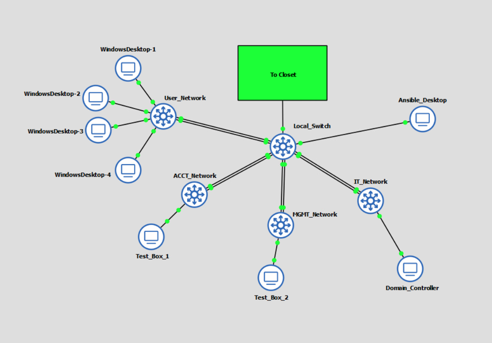

# Part I: VLAN Deployment Automation Solution

### Configure the VLAN infrastructure and set up continuous integration by doing the following:

A.  Write a Python script that identifies existing VLANs within Access Closet 1 on the 10.10.1.1 network.

B.  Write a Python script that adds and configures a separate VLAN for each of the four access layer switches in Access Closet 1 and configure all devices in the “Local” project in the Assessment Lab appropriately.  
1.	User_Network
2.	ACCT_Network
3.	MGMT_Network
4.	IT_Network

C.  Verify the VLAN infrastructure is configured properly by documenting the successful execution of your script.
D.  Integrate code within a private Git repository for continuous integration and deployment of the script.

E.  Describe the process you used to complete your VLAN deployment, including each of the following in your description:
- a list of the industry-standard tools used
- the outputs
- the inventory
- the validation, testing, and troubleshooting steps completed throughout the process

  

  

