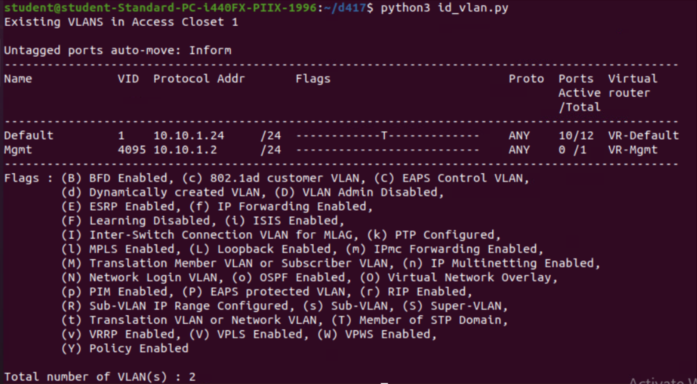
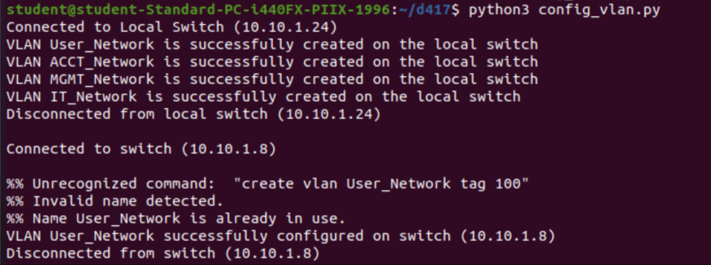
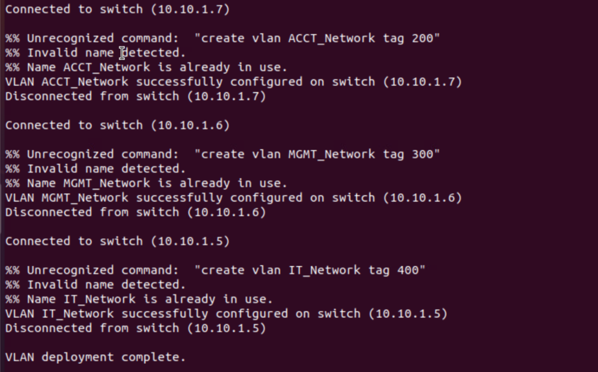

# Part I: VLAN Deployment Automation Solution

### Configure the VLAN infrastructure and set up continuous integration by doing the following:

A.  Write a Python script that identifies existing VLANs within Access Closet 1 on the 10.10.1.1 network.

- [View id_vlan.py](id_vlan.py)  

B.  Write a Python script that adds and configures a separate VLAN for each of the four access layer switches in Access Closet 1 and configure all devices in the “Local” project in the Assessment Lab appropriately.  
 
User_Network  
ACCT_Network  
MGMT_Network  
IT_Network  

- [View config_vlan.py](config_vlan.py)  

C.  Verify the VLAN infrastructure is configured properly by documenting the successful execution of your script.
   
The results of `python3 id_vlan.py`  

   
The results of `python3 config_vlan.py`  

  
 
D.  Integrate code within a private Git repository for continuous integration and deployment of the script.  
- See this directory.  

E.  Describe the process you used to complete your VLAN deployment, including each of the following in your description:
a list of the industry-standard tools used
the outputs
the inventory
the validation, testing, and troubleshooting steps completed throughout the process

- The industry-standard tools used is netmiko, which is a library for SSH connections and device configuration. Netmiko allows for consistency and efficiency in configuring VLANS across multiple switches. I specifically chose Netmiko over Paramiko due to its broader support and simplified interface.  

- The outputs are the command outputs returned by the switches when executing show and configuration commands. These outputs are captured in the ‘output’ variable.

- The inventory consists of device details, including device type, IP addresses, usernames, passwords, and ports. The script uses this inventory to establish connections with the switches and deploy the VLAN.

- Validation, testing, and troubleshooting steps include:  
·	Establish SSH connections to the switches  
·	Identifying switch IPs with ‘show configuration | include ipaddress’  
·	Executing show commands to retrieve existing VLANS for validation – ‘show vlan’  
·	Sending commands to create VLANS on the switches  
·	Verifying success of the VLAN deployment by printing the output  
·	Printing an error message with an exception

- There was an output error a few times in which a ‘//’ was appended at the end of each word when trying to connect to a switch. I changed the send_config_set to send_command and this fixed it.

- The config_vlan script essentially connects to switches, creates VLANS, and confirms deployment. Here is a breakdown of how it works.

  1.	The script imports the ‘ConnectHandler’ class from ‘netmiko’
  2.	Details of the switches are defined, including IP address, username, password, and SSH port.
  3.	The script establishes and SSH connection to the local switch and retrieves existing VLANS. It executes the ‘show vlan’ using the ‘send_command’ method of the ‘connection’ object. The output is stored in the output variable and printed.
  4.	The script disconnects using the disconnect method of the ‘connection’ object.
  5.	The script defines the VLANS to be created, sends commands to create the VLAN and adds them to the ‘config_commands’ list.
  6.	It sends the configuration commands to the switches with ‘send_config_set’ from the ‘connection’ object. Output is stored in the output variable and printed.
  7.	The script disconnects from the switches with the ‘disconnect’ method and prints a message that VLAN deployment is complete.
